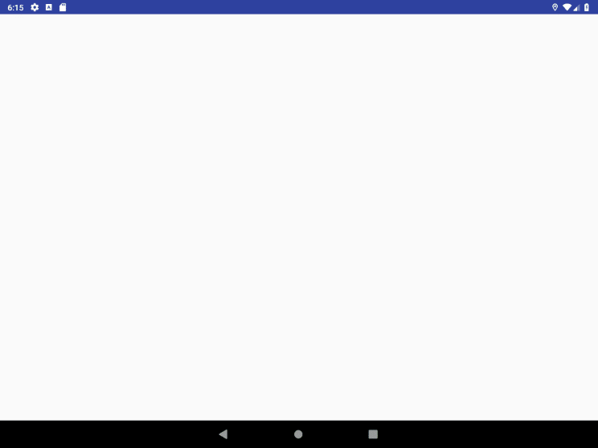

# Basic Vectorizing Game Mobile App

This is a project I did during my internship at [RIGIL](http://rigil.com). I and my colleagues worked on porting an App that was natively developed for iOS to the Android platform. I developed several components of the app before integrating them into the final work.

## Components of the App
Some of the projects in this folder were created for practice to familiarize myself with Android Studio. The following projects were relevant to the internship: 
- [CircularProgressBar](./CircularProgressBar): This project involves developing a semi-circular progress bar that corresponds to the progress of each game section. I used the [Circular Progress bar library](https://github.com/yuriy-budiyev/circular-progress-bar) developed by by [Yuriy Budiyev](https://github.com/yuriy-budiyev). I noticed a `duplicate value for resource 'attr/progress' with config ''` error kept occuring when I tried to integrate this feature into the complete app. I fixed this error in [commit a291840dfa87cf387abaf12201ef0e1fe530c6e5]((https://github.com/ChubaOraka/RIGIL-Projects/commit/a291840dfa87cf387abaf12201ef0e1fe530c6e5)) by changing 'progress' attribute in BasicVectorizingGame/app/src/main/res/values/attrs.xml according to [suggestions from Stack Overflow](https://stackoverflow.com/questions/47668526/duplicate-value-for-resource-attr-font-with-config/49775778#49775778)
- [ParticleEffect](./ParticleEffect): The iOS version of the app has a native tool - sprite kit scene - that was used to implement a particle effect. I replicated the same effect in the Android version using the [Partice System library](https://github.com/plattysoft/Leonids) developed by [Raul Portales](https://github.com/plattysoft) (to read more on it, check [this website](http://plattysoft.github.io/Leonids/)).
- [BasicVectorizingGame](./BasicVectorizingGame): This project integrates the various aspects of the project that were developed separately. An animated image of the final result can be viewed below:

NOTE: *BasicVectorizingGame* is the most recent iteration of the app.
